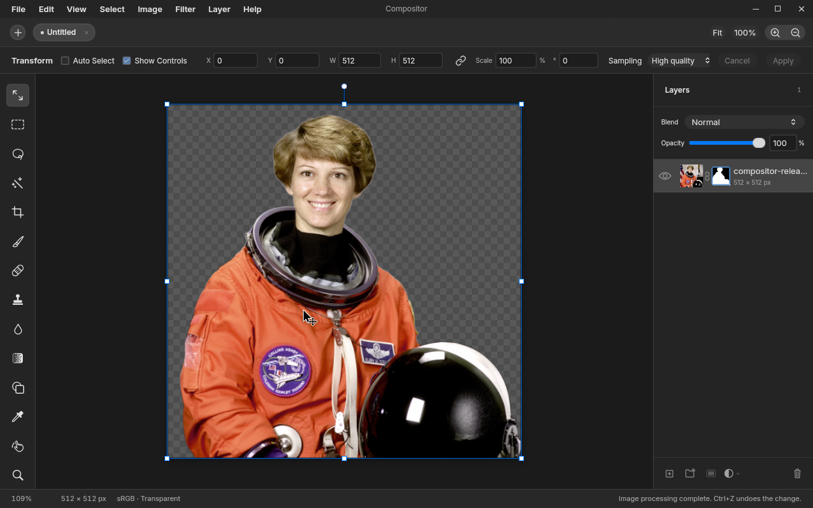
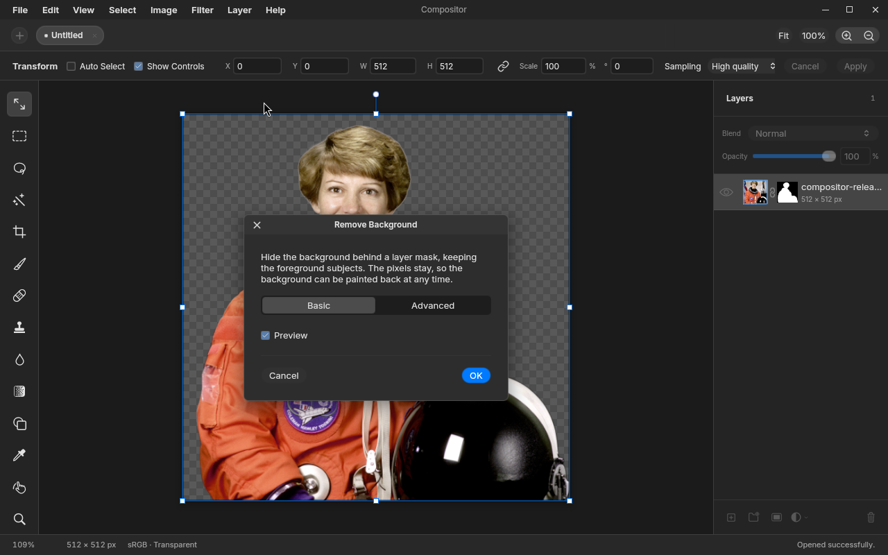

> [!NOTE]
> AI SLOPFORK

# Compositor for Linux

A layered image editor for Linux, built with Rust and [QuickGUI](https://github.com/egoist/quickgui). A fork of [Robbie Tilton's Compositor](https://github.com/robbietilton/Compositor), with GPU-accelerated editing and bundled, offline background removal.



## Get started

Download an AppImage from the latest successful [Linux AppImage build](https://github.com/AugusDogus/Compositor/actions/workflows/linux-release.yml) (GitHub sign-in required for artifacts). Tagged versions will appear in [Releases](https://github.com/AugusDogus/Compositor/releases).

```sh
chmod +x Compositor-*-x86_64.AppImage
./Compositor-0.1.0-x86_64.AppImage
```

Requires **x86_64 Linux, glibc 2.39+**, working graphics drivers, and desktop portals for file dialogs. Supports Wayland and X11. One AppImage bundles the models and native inference libraries for compatible NVIDIA/AMD Vulkan GPUs, with CPU selection when no compatible GPU is available. No Python or dependency setup is needed to use background removal.

[Launch options and troubleshooting](docs/linux-releases.md#running-an-appimage)

## Features and parity

The port implements the **macOS 1.0.4 editing inventory**. It does **not yet match macOS 1.1.6**, and pixel-identical output and real macOS project round trips are not fully verified.

| Available now | Includes |
| --- | --- |
| Layers | Groups, raster and clipping masks, 13 blend modes, six adjustment types |
| Painting and retouching | Brush, eraser, clone, healing, blur, smudge, liquify, gradients |
| Geometry | Non-destructive transforms, perspective, snapping, rectangle/ellipse shapes, crop and resizing |
| Selections | Marquee, lasso, polygon, magic wand, add/subtract/intersect, expand/contract |
| Processing | Levels, Curves, Hue/Saturation, filters, content-aware fill, BiRefNet background removal |
| Files | Read/write `.comp`, recovery, JPEG/PNG/HEIC/TIFF/WebP import, PNG/JPEG export, ICC conversion, clipboard |

**Not yet ported from newer macOS versions:** editable text, layer effects, line shapes, selection feathering, Soft Light, folder opacity and duplication, and the keyboard-shortcuts window. Background removal uses BiRefNet instead of Apple's Vision model, so results differ.

<details>
<summary>Screenshot: background-removal preview</summary>



</details>

[Feature status, compatibility limits and evidence](docs/linux-features.md)

## Other Linux ports

[Xuan](https://github.com/silverling/xuan), linked in [upstream's Linux issue](https://github.com/robbietilton/Compositor/issues/19#issuecomment-5744154350), is another Rust port. This fork emphasizes the original editing workflow and `.comp` format, bundled neural background removal, ICC conversion, and reuse of upstream's C processing kernels. Xuan adds editable text, Nikon RAW development, and TIFF/WebP export. [Compare the documented differences](docs/linux-features.md#comparison-with-xuan).

## Development

[Build from source](docs/linux-building.md) · [AppImage builds and releases](docs/linux-releases.md) · [Implementation notes](docs/linux-port.md)

## License

[MIT](LICENSE), preserving the original Compositor copyright. QuickGUI and bundled dependencies retain their own license notices. [Screenshot provenance](docs/screenshots/README.md).
