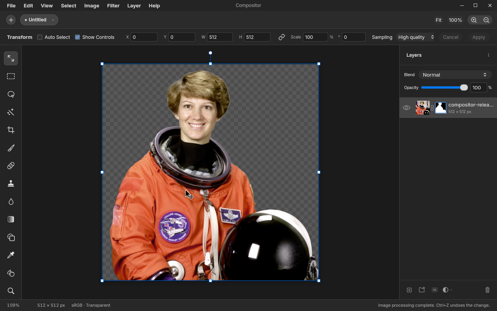

> [!NOTE]
> AI SLOPFORK

# Compositor for Linux

A layered image editor for Linux, built with Rust and [QuickGUI](https://github.com/egoist/quickgui). A fork of [Robbie Tilton's Compositor](https://github.com/robbietilton/Compositor).



## Download

**[Download AppImage (x86_64)](https://github.com/AugusDogus/Compositor/releases/latest)**

```sh
chmod +x Compositor-0.6.1-x86_64.AppImage
./Compositor-0.6.1-x86_64.AppImage
```

## Requirements

| Component | Requirement |
| --- | --- |
| Platform | x86_64 Linux, glibc 2.39+ |
| Desktop | Wayland or X11; XDG portals for file dialogs |
| Graphics | Working Vulkan or OpenGL driver |
| GPU background removal and object selection | NVIDIA/AMD Vulkan GPU with FP16 support; CPU used if unavailable[^background] |

[Launch options and troubleshooting](docs/linux-releases.md#running-an-appimage)

## Features and parity

The development version targets feature parity with **Compositor for macOS 1.3.3**. The table compares it with Xuan 0.2.2. [Latest release: v0.6.1](docs/releases/v0.6.1.md) · [Unreleased changes](docs/linux-features.md#unreleased).

✅ Supported · ⚠️ Partial or limited · ❌ Not supported

| Feature | [Compositor<br>(macOS&nbsp;1.3.3)](https://github.com/robbietilton/Compositor) | This fork (development) | [Xuan](https://github.com/silverling/xuan) |
| --- | :---: | :---: | :---: |
| Layers, groups and masks | ✅ | ✅ | ✅ |
| Blend modes and adjustment layers | ✅ 24 modes | ✅ 24 modes | ✅ 13 modes |
| Brushes, clone, healing and content-aware fill | ✅ | ✅ | ✅ |
| Brush stroke smoothing | ✅ | ✅ | ✅ |
| Tablet pressure, tilt and eraser tip | ❌ | ⚠️ Wayland/X11[^tablet] | ✅ |
| Gradients, rectangle and ellipse shapes | ✅ | ✅ | ✅ |
| Artboards and per-artboard PNG export | ❌ | ✅ | ❌ |
| Multiple export sizes and editable size variants | ❌ | ✅ | ❌ |
| Saved Bézier paths, path selection and painting | ❌ | ✅ | ❌ |
| Editable Bézier shape layers | ❌ | ✅ | ❌ |
| Layer transforms, perspective and snapping | ✅ | ✅ | ✅ |
| Marquee, lasso and magic-wand selections | ✅ | ✅ | ✅ |
| Color adjustments and filters | ✅ | ✅ | ✅ |
| Photo Filter, Channel Mixer and Selective Color | ❌ | ✅ | ❌ |
| Threshold and Posterize filters and adjustment layers | ❌ | ✅ | ❌ |
| Dither, halftone and ASCII filters | ✅ | ✅ | ❌ |
| Numeric label dragging and colored adjustment tracks | ✅ | ✅ | ❌ |
| Crop, canvas and image resizing | ✅ | ✅ | ✅ |
| Image Trim | ✅ | ✅ | ❌ |
| Camera Raw Filter | ✅ | ✅ | ❌ |
| Black & White, Color Balance and Invert adjustment layers | ✅ | ✅ | ⚠️ Invert |
| Gaussian Blur, Motion Blur and Add Noise layers | ✅ | ✅ | ⚠️ Filter layers[^filters] |
| Vignette, Bloom and Tonal Contrast | ✅ | ✅ | ⚠️ Vignette[^filters] |
| Background removal | ✅ Apple Vision[^background] | ✅ BiRefNet[^background] | ⚠️ Border-color matte[^background] |
| Original `.comp` projects | ✅ Read/write | ⚠️ Read/write[^projects] | ⚠️ Import only[^projects] |
| ICC color conversion | ✅ | ✅ | ❌ |
| HEIC import | ✅ | ✅ Bundled | ✅ Bundled |
| SVG import | ✅ Rasterized | ✅ SVG/SVGZ, rasterized | ❌ |
| PNG/JPEG export | ✅ | ✅ | ✅ |
| TIFF/WebP export | ❌ | ✅ | ✅ |
| Editable text | ✅ | ✅ | ✅ |
| Per-character text colors | ✅ | ✅ | ❌ |
| Camera RAW development | ✅ | ✅[^raw] | ⚠️ Nikon/Canon[^raw] |
| Stroke, drop shadow, color overlay and inner shadow | ✅ | ✅ | ❌ |
| Outer Glow and Inner Glow | ✅ | ✅ | ❌ |
| Pattern Overlay and PAT import | ❌ | ✅ | ❌ |
| Gradient Overlay | ❌ | ✅ | ❌ |
| Line shapes | ✅ | ✅ | ❌ |
| Selection feathering | ✅ | ✅ | ✅ |
| Soft Light blend mode | ✅ | ✅ | ❌ |
| Folder opacity and duplication | ✅ | ✅ | ✅ |
| Keyboard-shortcuts editor | ✅ | ✅ | ⚠️ Reference window |
| PSD/PSB import | ⚠️ Layers, shapes, text, adjustments[^upstream-psd] | ⚠️ Layers, shapes, text, adjustments[^psd] | ❌ |
| PSD export | ❌ | ⚠️ Layers, adjustments and effects[^psd] | ❌ |
| Object selection | ✅ Click | ✅ Click/box[^objects] | ❌ |
| Object-selection edge adjustment and smoothing | ✅ | ✅ | ❌ |
| Select Subject | ✅ | ✅ BiRefNet[^objects] | ❌ |
| Rulers, guides and layout grid | ✅ | ✅ | ❌ |
| Open from Clipboard | ❌ | ✅ | ❌ |
| Open Recent and external project reload | ✅ | ✅ | ❌ |
| Continue editing during project saves | ✅ | ✅ | ❌ |
| Autosave and crash recovery | ❌ | ✅[^recovery] | ❌ |

[^background]: The AppImage includes offline models; no Python setup. NVIDIA and CPU inference are tested; AMD hardware is not. BiRefNet results differ from Apple Vision. Xuan's matte is intended for simple backgrounds.
[^projects]: Reads v1–10; writes v10. [Mac file-format tests passed](docs/macos-compatibility.md); full-app compatibility is unverified. Mac saves discard embedded RAW sources and settings. Xuan imports `.comp` but saves `.xuan`.
[^upstream-psd]: 8-bit RGB only. Unsupported text and smart objects become pixels; Photoshop effects are discarded. Conversions are reported.
[^psd]: 8-bit RGB or grayscale only. Unsupported text and smart objects use saved pixels; text and shapes become pixels on export. Photoshop export round trips are unverified. [Format support](docs/linux-features.md#file-compatibility).
[^objects]: SAM 3.1 selects objects; BiRefNet selects subjects. Boundaries may need manual correction. [Model details](docs/object-selection-models.md).
[^raw]: RAW Develop exports 16-bit TIFF; ordinary editing and export use 8-bit color. Foveon X3F is unsupported. [Camera support and limits](docs/linux-raw.md).
[^filters]: Xuan uses attached filter stacks and offers vignette through Lens Correction.
[^tablet]: Physical tablet hardware is untested.
[^recovery]: Snapshots run every 30 seconds. Undo history and unfinished dialog edits are excluded; changes since the last completed snapshot can be lost.

[Comparison sources and detailed feature status](docs/linux-features.md)

## Development

[Build from source](docs/linux-building.md) · [AppImage builds and releases](docs/linux-releases.md) · [Contributor guide](docs/linux-port.md)

## License

[MIT](LICENSE), preserving the original Compositor copyright. QuickGUI and bundled dependencies retain their own license notices. [Screenshot provenance](docs/screenshots/README.md).
